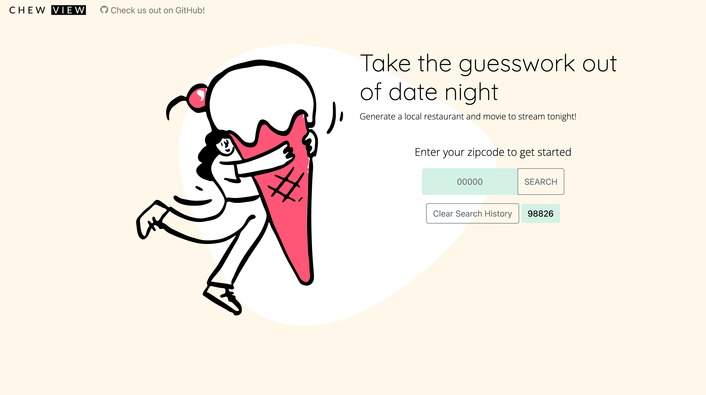

# Chew View

## Summary

Simplify date night and speed up decision making. Chew View helps pick a movie & food pairing and discover new options. Simply enter your zipcode and decide on movie genre and restaurant cuisine to generate some options.

## Deployment

[katiechurchwell.github.io/chew-view/](https://katiechurchwell.github.io/Chew-View/)

## Screenshot

## Contributions
* Chris Lawn - https://github.com/ChristopherLawn
* Daniel Harned - https://github.com/DrDano
* Katie Churchwell - https://github.com/katiechurchwell
* Kenneth Washington - https://github.com/iiMKenny
* Zachary Clark - https://github.com/zaclark369

## Credits
Landing page graphic credit to [Open Doodles](https://www.opendoodles.com/).

## Questions

This redesign is currently maintained by Katie Churchwell:

- [katiechurchwell](https://www.github.com/katiechurchwell)
- [churchwellcatherine@gmail.com](mailto:churchwellcatherine@gmail.com)

---

